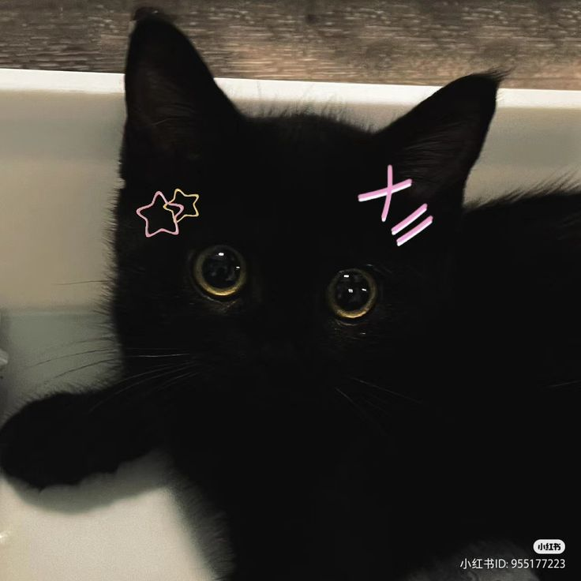

# Primeiros passos com o php | Estudonauta

### Começo de uma jornada com o Guanabara e o PHP

To empolgada e gostando bastante (por enquanto) do que to estudando, como já possuo familiaridade com JavaScript e lógica de programação, muitos conceitos se tornam mais fáceis e gostosos de aprender e entender. Espero aprender direito kkkkk 

Estou muito animada por ter começado a aprender uma nova linguagem de programação e embora possa parecer um pouco assustador no começo, tenho certeza de que, com esforço e prática o suficiente, vou me sentir mais confortável e  mais confiante.  Sei que é normal me sentir sobrecarregada ou até mesmo desanimada no começo, mas com o tempo vou dominar o php vcs vao ver (tenho esperança kkkkkkk). vou dividir o aprendizado em passos menores e tentar não ter medo de cometer erros, afinal, é assim que aprendemos e crescemos. 

<h2 align="center">
  
</h2>

Desenvolvido com 🧡

